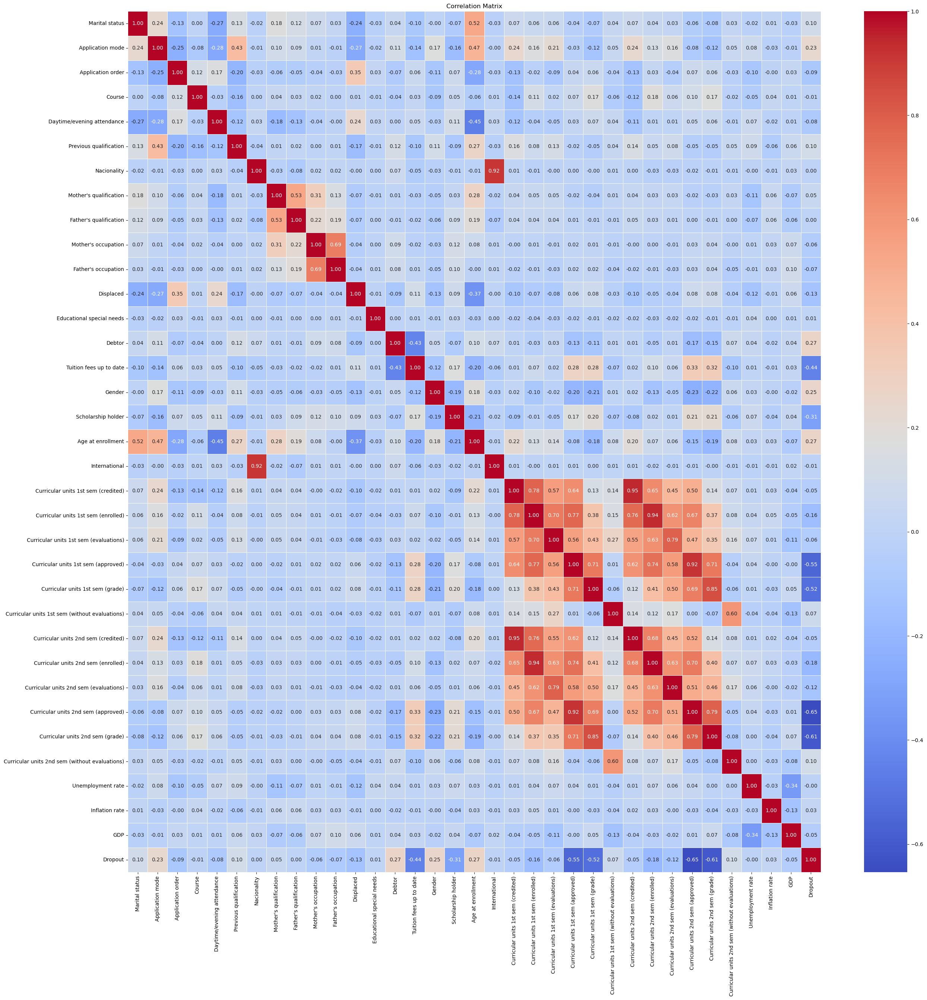
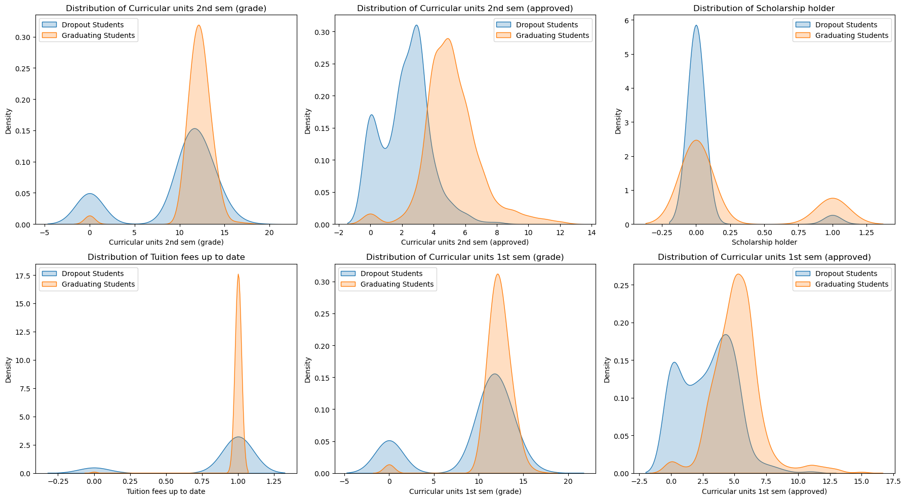
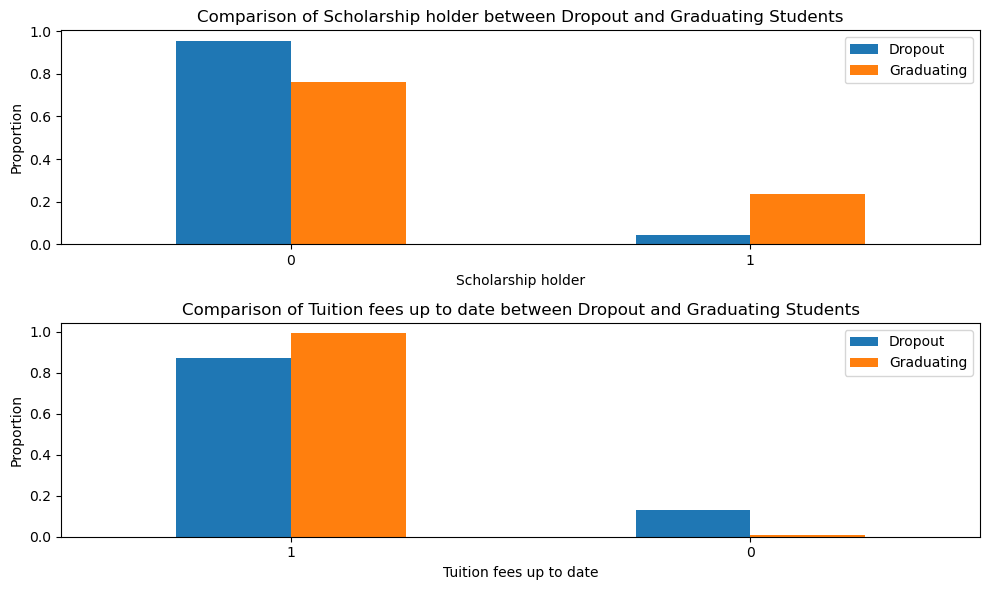

# Student Dropout Prediction and Graduation Probability Analysis

## Project Overview

The goal of this project is to develop predictive models that identify students at risk of dropping out and assess the probability of graduation. The analysis focuses on understanding students' academic progress and identifying factors that influence dropout or graduation. This can lead to better-targeted interventions aimed at improving student retention rates and academic success.

### Key Objectives
- **Predict Dropout Risk**: Identify students who are likely to drop out based on academic and demographic features.
- **Predict Graduation Probability**: Estimate the likelihood of students graduating to provide early interventions and support.
- **Feature Importance**: Analyze the most significant features contributing to both dropout and graduation predictions.

## Dataset Overview

The dataset used in this project is from Kaggle, titled *Higher Education Predictors of Student Retention*. The dataset includes a range of features, such as:
- Academic performance (grades, approval rates)
- Financial factors (scholarships, tuition fees)
- Demographic data (marital status, nationality, etc.)

You can access and download the dataset from the following Kaggle link:
[Higher Education Predictors of Student Retention Dataset](https://www.kaggle.com/datasets/thedevastator/higher-education-predictors-of-student-retention)

The dataset was split into two parts:
1. **Students who are enrolled** – Used to predict which students are at risk of dropping out.
2. **Students who dropped out or graduated** – Used to analyze factors contributing to dropouts and graduation.

## Data Cleaning and Preprocessing

1. **Data Cleaning**: The dataset was cleaned by removing missing values and duplicates.
2. **Feature Engineering**:
   - Created binary labels for dropout risk (0 = Not Dropout, 1 = Dropout).
   - Converted categorical features into numerical values using one-hot encoding.
3. **Correlation Matrix**: A correlation matrix was created to identify relationships between features, helping to highlight the most important features for dropout prediction.

## Models and Analysis

### 1. **Decision Tree for Dropout Prediction**
- A decision tree classifier was used to predict the risk of dropout based on features such as academic performance, financial support, and others.
- The accuracy of the model was evaluated using a confusion matrix and classification report.
- The most important features for predicting dropouts were identified, including `Curricular units 2nd sem (grade)`, `Curricular units 2nd sem (approved)`, `Scholarship holder`, `Tuition fees up to date`, `Curricular units 1st sem (grade)`, `Curricular units 1st sem (approved)`.
  
**Correlation Matrix**:


### 2. **Graduation Probability**
- The probability of students graduating was predicted using a decision tree, resulting in a probability score for each student.
- Based on this, students with a probability of graduation below 0.4 were considered "at risk" for not graduating.
- Key features influencing graduation probability were identified, such as `Curricular units 2nd sem (grade)`, `Curricular units 2nd sem (approved)`, `Scholarship holder`, `Tuition fees up to date`, `Curricular units 1st sem (grade)`, `Curricular units 1st sem (approved)`.


### 3. **Feature Importance**
- Feature importance was calculated using the decision tree model, revealing the most influential features for both dropout and graduation predictions.
- For dropouts, `Curricular units 2nd sem (approved)` had the highest importance score (0.84), indicating it is a critical predictor.

**At-Risk Students**: Students with a low probability of graduation were analyzed to identify key risk factors (e.g., low grades, missed tuition payments).

**Graduating Students**: Students predicted to graduate showed higher approval rates in academic units and better financial stability.

### 4. **Distribution Comparisons and Visualizations**
- Various visualizations were created to compare the distributions of key features between students at risk of dropping out and those who are graduating.
- KDE plots were used to visualize the differences in academic performance and other features between these groups.
- Bar plots were used to compare categorical features like scholarship status and tuition fee payment.

**Distribution of Strong Features**:


**Scholarship and Tuition Fee Status Comparison**:


**Pairplot of Academic Performance**:
A pairplot was used to analyze the relationship between the 1st and 2nd-semester approval rates, highlighting how students who struggled in the first semester are at higher risk of dropping out in the second semester.

## Conclusion and Insights

1. **Key Risk Factors**:
   - Students who perform poorly in the first semester (low approval rates) are at a higher risk of having the same performance in the second semester, increasing the likelihood of dropping out.
   - Financial difficulties, such as not having tuition fees up to date or not receiving scholarships, also increase dropout risk.
   
2. **Interventions**:
   - Focus on students with low approval rates in the first semester. These students should be monitored closely and given additional support to prevent further academic decline.
   - Provide financial aid or other support to students struggling with tuition payments to reduce dropout rates.

3. **Model Performance**:
   - The decision tree model achieved an accuracy of 89% when using only the strongest features for dropout prediction, making it a valuable tool for identifying at-risk students.

## Files in the Repository

- **Ana.ipynb**: Notebook for data cleaning, dropout prediction, and feature analysis using decision trees.
- **Xinyi.ipynb**: Notebook for additional machine learning models and comparisons.
- **dataset.csv**: The dataset used in the project.
- **strong_features.png**: Visualization comparing the distribution of strong features between dropout and graduating students.
- **money.png**: Bar plot comparing the proportion of students with scholarships and up-to-date tuition fees.
- **Project.ipynb**: Objective and instructions of the project.
- **students_enrolled.csv**: Dataset with students enrolled in the university.
- **students_not_enrolled.csv**: Dataset with students who dropped out or graduated.
- **corr_matrix.png**: Correlation matrix plot.

## How to Run the Code

1. Clone this repository to your local machine:
```bash
    git clone https://github.com/yourusername/dropout-prediction.git
```

2. Install the required dependencies  manually:

```python
import pandas as pd
import numpy as np
import matplotlib.pyplot as plt
from sklearn.model_selection import train_test_split
from sklearn.tree import DecisionTreeClassifier, plot_tree
from sklearn.metrics import accuracy_score, classification_report, confusion_matrix
import seaborn as sns
import matplotlib.pyplot as plt
from sklearn.metrics import classification_report, confusion_matrix, accuracy_score
```


3. Run the Jupyter notebooks: jupyter notebook `Ana.ipynb`. 


